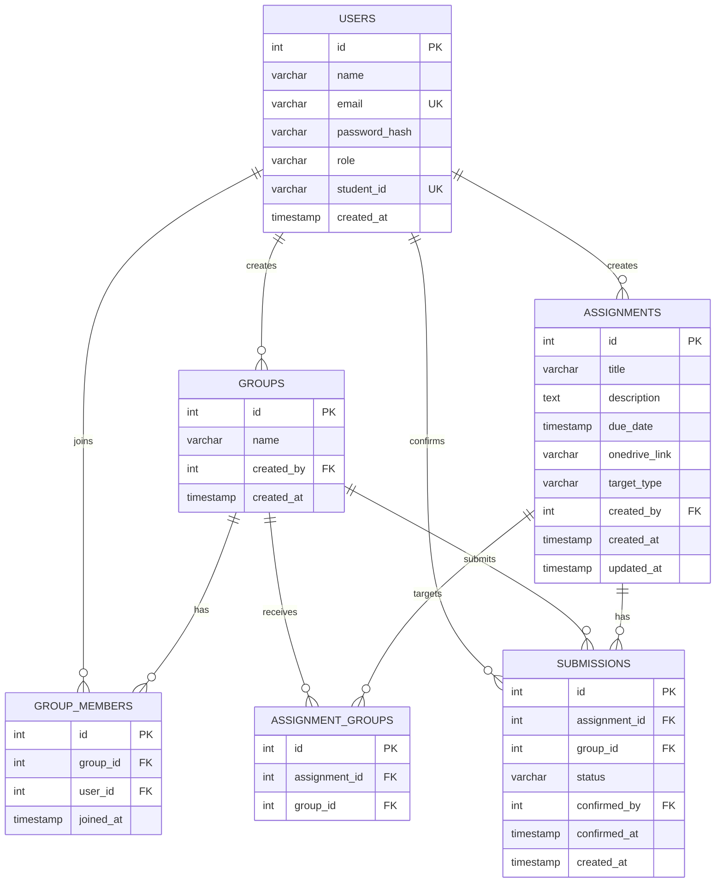

# GroupSync — Student, Group & Assignment Management System

A role-based full-stack web application where **students** form their own groups, manage members,
and confirm assignment submissions, while **professors (admins)** post assignments and track
group-wise submission progress through a unified dashboard.

Built for the GroupSync Full Stack Intern technical task.

---

## Live Demo

🔗 **Deployed URL:**  [GroupSync](http://groupsync-theta.vercel.app/)

---

## 1. Tech Stack

| Layer          | Technology                                    |
|----------------|------------------------------------------------|
| Frontend       | React.js (Vite), Tailwind CSS, React Router    |
| Backend        | Node.js, Express.js                            |
| Database       | PostgreSQL                                      |
| Auth           | JWT (JSON Web Tokens), bcrypt password hashing  |
| Containerization | Docker & Docker Compose                       |

---

## 2. Project Structure

```
├── backend/
│   ├── src/
│   │   ├── config/db.js          # PostgreSQL connection pool
│   │   ├── controllers/          # Route handler logic
│   │   ├── middleware/auth.js    # JWT auth + role guard
│   │   ├── routes/               # Express routers
│   │   ├── utils/                # jwt helper, migrate.js, seed.js
│   │   ├── schema.sql            # Full DB schema
│   │   └── index.js              # App entry point
│   ├── Dockerfile
│   ├── package.json
│   └── .env.example
├── frontend/
│   ├── src/
│   │   ├── api/axios.js          # Axios instance + JWT interceptor
│   │   ├── context/AuthContext.jsx
│   │   ├── components/           # Navbar, ProgressBar, modals, cards...
│   │   ├── pages/                # Login, Register, Dashboards, etc.
│   │   └── App.jsx               # Route definitions
│   ├── Dockerfile
│   ├── package.json
│   └── .env.example
├── docker-compose.yml
└── README.md   (this file)
```

---

## 3. Architecture Overview

```
┌───────────────────┐       HTTPS/JSON          ┌──────────────────┐        SQL       ┌───────────────┐
│  React Frontend   │  ──────────────────────►  │  Express Backend │  ──────────────► │  PostgreSQL   │
│  (Vite + Tailwind)│  ◄──────────────────────  │ (REST API + JWT) │  ◄────────────── │   Database    │
└───────────────────┘       JWT in header       └──────────────────┘                  └───────────────┘
```

- **Frontend (React + Tailwind)**: Talks to the backend exclusively through a REST API using Axios.
  The JWT returned at login/register is stored in `localStorage` and automatically attached to every
  request via an Axios interceptor. Routes are protected client-side using a role-aware
  `ProtectedRoute` wrapper, and the UI branches into a **Student** experience and an **Admin**
  experience based on the logged-in user's role.
- **Backend (Express)**: A stateless REST API. Each request is authenticated via a JWT bearer token;
  `authenticate` middleware decodes the token and `authorize(role)` middleware restricts routes to
  specific roles. Controllers talk to PostgreSQL via a shared connection pool (`pg`), using
  parameterized queries throughout to prevent SQL injection. Group/assignment creation and submission
  confirmation use transactions where multiple related rows must be written atomically.
- **Database (PostgreSQL)**: Normalized relational schema (see ER diagram below) enforcing referential
  integrity with foreign keys and `ON DELETE CASCADE` where appropriate, plus `CHECK` constraints for
  enums (`role`, `status`, `target_type`) and `UNIQUE` constraints to prevent duplicate memberships or
  duplicate submission rows.

---

## Database & ER Diagram

The application uses PostgreSQL with six main tables:

- `users` — stores student and admin accounts
- `groups` — stores groups created by students
- `group_members` — connects users to groups
- `assignments` — stores assignments created by admins
- `assignment_groups` — connects assignments to specific groups when needed
- `submissions` — tracks whether a group has confirmed an assignment submission

### ER Diagram



**Key design decisions:**
- `submissions` is keyed on `(assignment_id, group_id)` — submission status is tracked **per group**,
  not per individual student, matching the requirement that groups confirm submission together.
- When an assignment is created, a `pending` submission row is pre-created for every targeted group.
  This lets the admin dashboard immediately show "0/5 groups confirmed" instead of having to infer
  totals from absence of rows.
- `assignment_groups` is a join table used only when an assignment targets specific groups
  (`target_type = 'group'`); when `target_type = 'all'`, every current group is a target and the
  join table is left empty for that assignment (all-groups membership is computed dynamically).

The raw SQL is in [`backend/src/schema.sql`](./backend/src/schema.sql).

---

## 5. Setup & Run Instructions

### Option A — Docker (recommended, one command)

**Prerequisites:** Docker & Docker Compose installed.

```bash
git clone "https://github.com/Sourabhgupta-11/Joineazy_assignment"
docker compose up --build
```

This will:
1. Start a PostgreSQL 16 container and create the `groupsync_db` database.
2. Build & start the backend, running migrations automatically on boot, exposed on **http://localhost:5000**.
3. Build & start the frontend, exposed on **http://localhost:5173**.

Once running, open **http://localhost:5173**, click **Register**, and create a Professor (Admin)
account and one or more Student accounts to try the full flow.

To seed a demo admin + 6 demo students instead of registering manually:
```bash
docker compose exec backend npm run seed
```
Demo logins (password: `Password123!`):
- Admin: `rama_admin@groupsync.com`
- Student: `sourabh@groupsync.com`

To stop: `docker compose down` (add `-v` to also wipe the database volume).

### Option B — Manual local setup

**Prerequisites:** Node.js 18+, PostgreSQL 14+ running locally.

**1. Database**
```bash
createdb groupsync_db
```

**2. Backend**
```bash
cd backend
cp .env.example .env
# edit .env if your Postgres credentials differ from the defaults
npm install
npm run migrate      # applies schema.sql
npm run seed         # optional: creates demo admin + students
npm run dev           # starts on http://localhost:5000
```

**3. Frontend** (in a new terminal)
```bash
cd frontend
cp .env.example .env
npm install
npm run dev           # starts on http://localhost:5173
```

Open **http://localhost:5173** in your browser.

---

## 6. API Endpoint Reference

Base URL: `/api`. All routes except `/auth/register` and `/auth/login` require an
`Authorization: Bearer <token>` header.

### Auth
| Method | Endpoint            | Access | Description                          |
|--------|----------------------|--------|---------------------------------------|
| POST   | `/auth/register`    | Public | Register as `student` or `admin`      |
| POST   | `/auth/login`        | Public | Log in, returns JWT + user object     |
| GET    | `/auth/me`            | Auth   | Get the current logged-in user        |

### Groups
| Method | Endpoint                          | Access          | Description                                      |
|--------|-------------------------------------|------------------|---------------------------------------------------|
| POST   | `/groups`                          | Student          | Create a new group (creator auto-joins)           |
| GET    | `/groups/mine`                     | Student          | List groups the current student belongs to        |
| GET    | `/groups`                          | Admin            | List all groups with member details               |
| GET    | `/groups/:id`                      | Member or Admin  | Get a single group's details + members            |
| POST   | `/groups/:id/members`              | Group member     | Add a student by email or student ID              |
| DELETE | `/groups/:id/members/:userId`      | Group creator    | Remove a member (creator cannot remove self)      |

### Assignments
| Method | Endpoint             | Access | Description                                             |
|--------|------------------------|--------|-----------------------------------------------------------|
| POST   | `/assignments`        | Admin  | Create assignment; `targetType` = `all` or `group`         |
| PUT    | `/assignments/:id`    | Admin  | Edit title/description/due date/OneDrive link              |
| GET    | `/assignments`        | Auth   | Admin sees all; student sees only assignments visible to them |
| GET    | `/assignments/:id`    | Auth   | Get a single assignment                                    |

### Submissions
| Method | Endpoint                                              | Access          | Description                                    |
|--------|---------------------------------------------------------|------------------|---------------------------------------------------|
| POST   | `/submissions/:assignmentId/groups/:groupId/confirm`   | Group member     | Two-step confirm (`{ "confirm": true }`)          |
| GET    | `/submissions/group/:groupId`                          | Member or Admin  | Submission status + progress % for a group        |
| GET    | `/submissions/assignment/:assignmentId`               | Admin            | Per-group submission status for one assignment     |

### Admin Analytics
| Method | Endpoint            | Access | Description                                                     |
|--------|-----------------------|--------|--------------------------------------------------------------------|
| GET    | `/admin/analytics`   | Admin  | Summary counts + per-assignment and per-group completion breakdown |

---

## 7. Feature Walkthrough

### Student
1. **Register / Login** with a student account (JWT issued).
2. **Groups page** — create a group (auto-joins as creator) and add classmates by email or student ID.
3. **Assignments page** — view all assignments visible to your groups, open the OneDrive submission
   link, and confirm submission through a **two-step flow**: "Yes, I have submitted" → final
   "Confirm Submission" — matching the spec's two-step verification requirement.
4. **Dashboard** — see each group's live progress bar (`confirmed / total assignments`).

### Admin (Professor)
1. **Register / Login** with an admin account.
2. **Assignments page** — create an assignment with a title, description, due date, and OneDrive
   link, and choose whether it targets **all students** or **specific groups**. Expand any
   assignment to see a live per-group confirmation checklist.
3. **Groups page** — view every group and its members across the platform.
4. **Analytics dashboard** — summary counts (students, groups, assignments, confirmed/pending
   submissions), an overall completion bar, and completion breakdowns by assignment and by group.

---

## 8. Security Notes

- Passwords are hashed with **bcrypt** (10 salt rounds) — never stored in plaintext.
- All authenticated routes verify a JWT signed with `JWT_SECRET`; role-based middleware (`authorize`)
  prevents students from hitting admin-only endpoints and vice versa.
- All SQL queries are parameterized (`$1, $2, ...`) — no string-concatenated SQL, preventing
  injection.
- Group-scoped endpoints (viewing/confirming submissions, adding members) verify the requester is
  actually a member of that group before allowing the action.

---

## 9. Key Design & Deployment Decisions

- **Raw SQL over an ORM**: chosen for transparency and to make the schema/relationships explicit and
  easy to review during the technical interview, at the cost of slightly more verbose queries.
- **JWT over sessions**: keeps the backend stateless, which simplifies horizontal scaling and Docker
  deployment (no shared session store needed).
- **Submission tracked per group, not per student**: matches the real workflow — one group submits
  once, and every member sees the same confirmed/pending state.
- **Pre-created "pending" submission rows**: makes progress-bar and analytics math trivial
  (`confirmed / total`) instead of requiring `LEFT JOIN` + null-handling everywhere.
- **Docker Compose** with a healthcheck on Postgres ensures the backend doesn't attempt migrations
  before the database is actually ready to accept connections.

---

## 10. Future Improvements

- Email notifications when a new assignment is posted or a due date approaches.
- File upload support as an alternative/backup to OneDrive links.
- Pagination and search/filter on the admin assignments and groups views.
- Automated tests (Jest/Supertest for the API, React Testing Library for the frontend).
